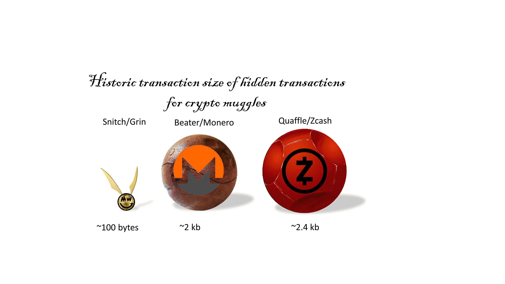

[WARNING THIS IS WORK IN PROGRESS AND MIGHT CONTAIN WRONG INFORMATION]  
# Grin for muggles AND aspiring wizards :thinking: :mage_woman:
This documentation aims to explain Grin and mimblewimble for regular users, muggles and aspiring wizards.
The format chosen for this document is a 'User Story' where I answers common questions from a user. Where possible I will simplify while at the same time being **explicit about the information flow between [users] - [nodes] - [wallets]**. 
This documentation is self serving, and represents my own struggles to understand Grin as a visual thinker, programmer and aspiring wizard. Since I have a background in Bitcoin, I will make many comparisons with Bitcoin; highlight where Grin is different from Bitcoin. This documents describe Grin's implementation of mimblewimble which is pure and minimal as mimblewimble was intended. Note that grin is "a" *mimblewimble* implementation. There are other projects like Beam, Tari (monero sidechain) and Litecoin that use mimblewimble or variations thereof. 

This document serves as an Add-On to the [official documentation](https://docs.grin.mw/wiki/introduction/grin-for-bitcoiners/). If you prefer a  conceptual high level description with awesome visualizations, I highly recommend reading [this explanation by Phyro](https://phyro.github.io/what-is-grin/). If you prefer a short video explaining the essentails, watch [this video on bulletproofs](https://www.youtube.com/watch?v=ilGfKH-kFiQ). Reading about Grin from multiple angles helped me greatly on my journey to understand Grin and I would recommend you to take a similar approach where you read multiple explenations. If your brain gets tired while reading, feel free to skip forward to the "SUMMARY" at the end of each section.<br/> <br/>

**Outline of this document:**

 1) How does my Grin wallet work?<br/>
 3) What is all this Elliptic Curve stuff?<br/>
 2) how does my Grin wallet create a transaction?<br/>
 3) How does my transaction gets on the blockchain?<br/>
 4) How does my wallet knows which outputs belong to it?<br/>
 5) An example for aspiring wizards<br/>
 6) Mind boggling realizations<br/>
 

***

# How does my Grin wallet work :purse: :key:?
Grin wallets are generated the same way as Bitcoin wallets. Grin follows the BIP32 standard in deriving a master seed from a mnemonic seed phrase (BIP39) and deriving children keys as a [Hierarchically Deterministic (HD)](https://learnmeabitcoin.com/technical/keys/hd-wallets/derivation-paths/https://learnmeabitcoin.com/technical/keys/hd-wallets/derivation-paths/https://learnmeabitcoin.com/technical/keys/hd-wallets/derivation-paths/https://learnmeabitcoin.com/technical/keys/hd-wallets/derivation-paths/) wallet. The process for deriving BIP32 HD wallets is that you start with a randomly generated number called ***seed***, which is presented to the users as a list of words called a ***seed phrase*** (12-24 words). From this seed phrase a master key as well as children keys are generated. HD wallets can be best understood by visualizing them as a tree:

            BIP32:
            Master  / Account/ Purpose / index                           Derivation_path
       
                                     / --3                          /m/0/0/3 (spend-key) 
                                    / ---2                          /m/0/0/2 (spend-key) 
                                   0 ----1                          /m/0/0/1 (spend-key)
                                 /    
    seed-phrase -> m ---- 0 --- |
                                 \    
                                   1 ----1                         /m/0/1/1 (change-key)       
                                    \ ---2                         /m/0/1/2 (change-key)    
                                     \ --3                         /m/0/1/3 (change-key)    
                    
 

Having multiple accounts is supported by *grin-wallet*. *Grin++* does not support multiple accounts, but instead supports having multiple wallet files. Preferably, both wallet software will support multiple accounts and multiple wallet files in the future.  
The most important thing to understand about your Grin wallet is that all keys are Hierarchically Deterministic (HD). This means that as long as you have the **seed(phrase)**, you can restore your wallet and derive the complete tree of derived keys. Losing funds when recovery from the seed phrase is therefore impossible! Your wallet seed is stored on your computer in a file called ***"wallet.seed"***. <br/><br/>
In the coming sections as well as in Grin's official documentation and on the forum, the word **"blinding factor"** is used. Make a mental note that a **blinding factor** is just a private-keys generated by your wallet and used to blind an output value. 
Later on in this document, I will describe `key 1`, `key 2`, `key 3` and abbreviate them as **k1, k2, k3,..**. These are just the private-keys generated and controlled by your and the recipients wallets. 

> **WARNING:**  
*Grin-wallet* stores the seed itself. This means that the mnemonic seed phrase should not be reused for other wallets.<br/><br/>


**Is my Grin wallet different from my Bitcoin wallet?**  
There are two important differences when using your Grin wallet compared to Bitcoin. These differences have to do with where Grin stores transaction data. 

First, grin nodes can freely "forget" transaction data from outputs that are spend. This is great for keeping the blockchain lightweight, but it also means your wallet cannot recover information about spend transactions from the blockchain. 

Second, Grin is amazing for privacy since outputs in a transaction can be aggregated 1) in a transaction (Dandelion, MWixnet) 2) in a block and 3) in the blockchain. This means that when you restore your wallet, even your own wallet cannot retrieve the link between inputs and outputs in a block! Your wallet can only scan the blockchain to see if there are unspent transaction outputs (UTXO's) associated to your wallet. Since your wallet only need to know about unspent outputs, your wallet balance is always correct. The same holds for all nodes, they only need to remember outputs that are unspent. Why spend outputs can be forgotten and why the nodes can still verify the blockchain while forgetting these outputs, will be explained later in this document.

Thirdly, Grin does not store all transaction information on chain. Payment proofs are created between you as sender and the receiver but are only stored in your wallet and not on the blockchain. Not storing Payment proofs on-chain keeps Grin lightweight and privacy preserving. The downside is that your wallet will not be able to restore payment proofs when recovering your wallet from the seed phrase. As merchant who uses Grin, it would be wise to make the occasional backup of your *wallet_data* folder to have backup of spend transaction outputs and payment proofs.


> **SUMMARY:**
Your Grin wallet is a normal BIP32 HD wallet. Your wallet seed is stored in a file called ***"wallet.seed"***. When you restore your wallet from the seed phrase, all funds will be recovered. However, you will not be able to: 1) see who send you a transactions, 2) see spend transaction outputs 3) restore payment proofs since this information is not stored on the blockchain. 
  
***
# How are transactions in Grin different from Bitcoin?
**Bitcoin transactions:**
In Bitcoin, the sender is in full control. The sender Signs the transaction data with a [digital signature](https://learnmeabitcoin.com/beginners/guide/digital-signatures/https://learnmeabitcoin.com/beginners/guide/digital-signatures/). Bitcoin addresses are either hashed public keys or a hash of a lock-script that includes your public key. [[REF](https://learnmeabitcoin.com/technical/keys/address/https://learnmeabitcoin.com/technical/keys/address/)]. Whenever someone sends Bitcoin to your address, she transfers ownership of the Unspent Transaction Outputs (UTXO's) in that transaction by saying *"Anyone who can provide a valid signature for the lock-script, can spend all outputs associated to this bitcoin address"*. Since only you can provide a valid signature for your hashed public-key/address, only you can spend Bitcoin send to your address. All miners can verify that your signature matches and include your transaction it in a block they are mining. Amounts and addresses are transparent, meaning anyone can exactly see how much Bitcoin is send and to who's address they are send.  
Bitcoin only uses pseudonymous addresses to create some minimal level of privacy.

**Grin transactions:**
Grin transactions have two main differences from Bitcoin transactions. 
First, in Grin transactions both users are in full control of their own inputs and outputs. To receive or spend an output in Grin, you have to 'Sign' for that output using your wallet keys. This means that to send a transaction you have to interact with the receiver since both your and the receivers wallet need to provide information for your own inputs and outputs ([See this explanation](https://phyro.github.io/what-is-grin/interactive_txs.htmlhttps://phyro.github.io/what-is-grin/interactive_txs.html)) **Sender and receiver jointly create a Signature** for the transaction.   
Second, in grin transactions, output values are hidden (blinded) and not bound to an address! Yep, that's right, **Grin has no addresses!**. Grin transactions use Elliptic Curve cryptography to make `commitments` of values, where the values are hidden and commited to to prove ownership.


The next section will explain in more detail how Grin's magic works in a) hiding amounts, b) not needing addresses, c) making transactions easy to aggregate.

**Grin transactions involve a couple of cool tricks**:    
1) **Homomorphic Commitments**: In Grin, values are hidden by multiplying values with a Generator point `H` on the secp256k1 Elliptic Curve. Multiplication with point on the curve is done by consecutive addition. It is however not addition in the traditional sense. It is iteratively "hopping" around the Elliptic Curve to find a new points. Since all input and output values are multiplied with the same generator point, they are "homomorphic", they are all in the "Elliptic Curve realm", meaning any operation performed on them such as addition and multiplication, is still valid. If a transaction would involve one input value and two output values `v1+v2-v3=0`, they can be multiplied with generator point `H` on an [Elliptic Curve](https://docs.grin.mw/wiki/introduction/mimblewimble/ecc/https://docs.grin.mw/wiki/introduction/mimblewimble/ecc/) and anyone can still verify they sum up to zero `v2*H + v3*H - v1*H = 0*H` without knowing any of the values `v1`, `v2` or `v3`. 
> **Elliptic Curve refresh:** The most important thing to understand about the "Elliptic Curve (EC) realm" is that addition and multiplication (through itterative addition) can be done, but devision is impossible due to the Elliptic Curve Discrete Logarithm Problem (ECDLP). The ECDLP can be explained as it being computationally infeasible to guess a large enough key since it would involve checking all possible keys of that size.  The fact that we can perform addition using EC points is the foundation for all EC algebra and is in Grin used to prove both ownership of outputs (coins) and non-inflation. Addition of EC is used to generate `public-key | private-key` pairs. For a more visuals explenation, try this awesome [Elliptic-curve explanation for 5 years old](http://royalforkblog.github.io/2014/09/04/ecc/?#explain-like-im-5-or-thereabouts), I found it usefull :smile: <br/>


2) **Pedersen Commitments**: As explained above, Grin transactions hide the amount in an output by multiplying them with a generator point `H`. However, this would allow people to find `v1`, `v2` or `v3` by guessing them. To solve this problem, a second trick is applied by adding a private-key multiplied with another generator point `G` to the output commitment. In case you were wondering, yes multiplying a key with a generator point creates a public key just like in Bitcoin! Adding a public-key to an output makes it impossible to find the value in an output:<br/>
`Output = k1*G+v1*H`. To an outsider an output commitment looks like a random piece of data, e.g. : `09551fd2ba097bbf53d027c9820c2f19a544a15f21cb46614ce5860077a3663181`.<br/><br/>  

3) **Range proofs:** There is one problem in Grin, that is: we have to make sure outputs do not have a negative value. Otherwise anyone could create a large negative output and equally large positive output to create Grin out of thin air!  
To solve this problem Grin uses range-proofs, to be precise, Grin uses [Bulletproofs](https://tlu.tarilabs.com/cryptography/bulletproofs-and-mimblewimblehttps://tlu.tarilabs.com/cryptography/bulletproofs-and-mimblewimble). Range-proofs are the most 'bulky' part of a Grin transaction at 674 bytes. Of these 674 bytes, 64 bytes are used to ***XOR*** a small message that contains the ***amount*** and ***derivation key index***, into the range proof. Your wallets therefore needs the range-proof associated to an output to know its value and to know which wallet key should be used by deriving the key with the specified index number. Without the range-proof, your wallet has no idea what value or private-key was used to create the output commitment. Therefore your wallet also 'forgets' spend outputs since the output commitment themselves can never be decomposed to reveal the value they contain.

4) **Joint Schnor signatures:** Hold on, if we add public keys `k1*G`, `k2*G` and `k3*G` to the output commitments, the outputs will not add up to zero right? Indeed, there is an excess that consists of the sum of all public-keys `(k2+k3-k1)*G` that together form a **joined public-key** called the **kernel excess**. All private-keys `(k2+k3-k1)` summed together form the **'excess'** which is a **joined public-key. Sender and receiver can together generate the kernel excess (just another point on the curve since it is a multiple of `G`) and sign for it using their joined private-key. Sender and receiver can prove a) knowledge of all private keys and b) that no new coins are generated by generating a valid Schnor signature for the kernel excess: <br/>
`sum(outputs) - sum(inputs) = kernel_excess - fee` 

**Putting it all together:**  
The **transaction kernel** contains the excess commitment and the joined signature.
A typical Grin transaction consist of a) a **single transaction kernel** b) a *range proof* per output and c) a **public fee**.


> **SUMMARY:**    
Grin transactions are interactive, each party signs for their own outputs. Outputs can be aggregated to find the **kernel-excess**, which serves as a **joined public key**. The excess of all private-keys serves as a **joined private-key**. Together they can create **joined signature** to prove that a) all values add up to zero, and b) that they know all private-keys. Grin ***output commitment*** are both ***binding*** and ***hiding***. Any node can verify the outputs in a transaction, in a block or in the entire block-chain without knowing any of the output values and commitments are binding, meaning not even the owner of the output can change its value after committing.   
Range-proofs (bulletproofs) contain the information needed for your wallet to spend an output in addition to proving the value is non-negative. After you spend an output, all nodes will forget the output range-proof since it is no longer relevant. Spend outputs occur both as an input and as an output, therefore they are not needed to validate the blockchain state is correct.

*** 

# How does my transaction gets on the blockchain?
Grin transaction are broadcasted to the peers your node is connects to. Since the node does not use the Tor network, it means that your peers know that you send a transaction as well as your IP address. To protect you from this privacy leak, *grin-wallet* by default uses Dandelion to help protect your anonymity [[REF](https://docs.grin.mw/wiki/miscellaneous/dandelion/)]. 
Remember that Grin transactions can be freely aggregated. Therefore transactions are merged when they are put in a block.
Since there are no addresses or otherwise identifying information in transactions, there is very little you can learn by analyzing the Grin blockchain. The more transactions are aggregated, the harder it will be to guess which inputs and outputs are linked. Simply put, unless an observer had access to transaction data before aggregating, he or she does not know which inputs or outputs are linked. That is pretty neat trick to improve the anonymity for all transactions.  

There is however another very important aspect of "aggregating" that we have to discuss. Any output that is spend occurs both as input as well as output with the same public-key, meaning its value is identical. As you have learned in basic math, if you sum two equations and something occurs on both sides of an equation  (so both with + and -), you can simply ~cross it out~.   
For example if we have two transactions with `A,B,C,D` being inputs when on the left of the '=' symbol and being outputs when on right of the `=` symbol, they can be aggregated:<br/><br/>
*transaction 1: A = B + C <br/>*
*transaction 2: B = D + E  <br/>*
*_________________________________+ <br/>*
*Aggregated   : A ~~+B-B~~ = C+D+E <br/>*

The same holds true when considering the blockchain as a whole, all transactions can be added/aggregated to calculate whether the supply is correct and all input commitments that also occur as output commitments, can be discarded:<br/><br/>
`sum(UTXO's) = sum(kernel's) + height * 60 * H` 
  
This means that all nodes can simply forget an output ever existed once it is spend!. **Grin only remembers unspent transaction outputs**. This is great for saving blockchain space (scalability) as well as for privacy. To put this to the test, make a backup of your **wallet_data** folder, delete the original and try restoring your wallet from the seed. You  will find-out that even your own wallet will have forgotten transactions for which the outputs were spend :astonished:.

> **TAKE AWAY:**
 In grin, every transaction is a MultSig where both sender and receiver create a partial signature where they sign for their own inputs and outputs. Their partial-signature together creates the signature for the whole transaction. Transactions can be freely be aggregated at the level of a) a transactions, b) a block, c) the blockchain. A node treats the Grin blockchain as one large transaction! To verify this "large transaction" is true, you node verifies:   
`sum(UTXO's) = sum(kernel's) + height * 60 * H`   
The above simple equation proves that no new coins are created apart from the block reward as well as the validity of all transactions. This trick of "forgetting" spend outputs is called *[cut-through](https://docs.grin.mw/wiki/introduction/(og)introduction-to-mimblewimble/#cut-throughhttps://docs.grin.mw/wiki/introduction/(og)introduction-to-mimblewimble/#cut-through)*.


# How does my wallet knows which outputs belong to it?  
Output commitments themselves cannot be decomposed by your wallet. Output `commitments` are **binding** and **hiding** and provide **proof** of **ownership** and **non-inflation**. See the previous section for the full explanation. The real information about outputs is retrieved from their associate **range-proof**. Range-proofs are XOR'ed with a *nonce* and *index* to indicate which wallet key were used. Since your wallet can scan for range-proof that are  XORed with your wallet keys, it scan for outputs and decode the *amount* and *key index* for from the range-proof. The wallet now knows the *amount* and *key index* it retrieved from the range-proof of outputs the wallet wants to use. The wallet can use these to calculate new outputs and the transaction kernel excess jointly with the receiver. The jointly calculated the excess of private keys which is called the **kernel_excess** and only is a valid valid public key for G if all values in the transactions add up to zero. Hence the kernel excess is both a signature to prove ownership of the keys as well as proving no new coins are create through the transaction (non-inflation)! [[REF](https://tlu.tarilabs.com/cryptography/bulletproofs-and-mimblewimblehttps://tlu.tarilabs.com/cryptography/bulletproofs-and-mimblewimble)]


# An example for aspiring wizards :mage:
Lets say you create a transaction with one input and two outputs (one is your change output):<br/><br/>

C1 = k1* **<span style="color:blue">G</span>** + v1* **<span style="color:red">H</span>**  
C2 = k2* **<span style="color:blue">G</span>** + v2* **<span style="color:red">H</span>**
C3 = k3* **<span style="color:blue">G</span>** + v2* **<span style="color:red">H</span>** <br/><br/>
How do you prove that as sender you know private keys `k1` and `k2` and the receiver knows `k3`? Remember that **addition using EC generator points works**, meaning that we can add these three commitments `C1`, `C2` and `C3` in a new commitment. `C1`, `C2` and `C3` are all points on the Elliptic Curve, adding up these generator points just create a new generator point on the same curve. Adding up all input and output commitments plus the fee will-add up to *`0`*. For simplicity we will ignore the fee in the formula below.

C1 + C2 + C3 = (k2+k3-k1)* **<span style="color:blue">G</span>** + (v2+v3-v1)* **<span style="color:red">H</span>** = kernel_excess* **<span style="color:blue">G</span>** + 0* **<span style="color:red">H</span>** = kernel_excess* **<span style="color:blue">G</span>**<br/>

*kernel_excess* G is a **joined-public-key**, while kernel_excess is a **joined-private-key*** <br/><br/>
> **_FOR PROGRAMMERS:_** A more programmatic way to write the same would be: <br/>
sum(v1+v2+v3)* **<span style="color:red">H</span>** - sum(K1+K2+K3)* **<span style="color:blue">G</span>** <br/>


If the output values don't sum to 0, the excess value will not be a valid public key for **<span style="color:blue">G</span>**. This ensures that:

*  The transacting parties can collectively produce the excess value (it is the private key of their **joint signature**).
* **The sum of the outputs minus the inputs is 0**, because only a valid public key for G will check out against the joined signature generated by the kernel-excess.
<br/><br/>


Schnor Signature are also used in Bitcoin Taproot transactions. Schnor signature create very small and uniform Signatures where any number of parties can combine their private-keys and public-keys. Bitcoin uses Schnor Signature signatures to have 40% smaller transactions and to allow MultiSig using a single public and private-key, a property why Grin uses these Signatures. 
In the case of a single sender and a single receiver, **Grin transactions are basically a 2 out of 2 MultiSig transaction**. In theory more parties can be supported in the future. However, a generalized MultiSig solution with more than two parties involves some extra security concerns[[REF](https://gist.github.com/phyro/0f26da4a97e2f4f180bba9a44e20e290https://gist.github.com/phyro/0f26da4a97e2f4f180bba9a44e20e290)].

The (kernel-)excess value of a transaction is the sum of all outputs blinding factors, minus the sum of all inputs blinding factors, `sum(outputs) - sum(inputs) = kernel_excess`. Remember that blinding factors are just private keys  generated by your wallet and the receivers wallet multiplied by `G` to create a public-key. 
Both **signers interactively sum their individual public keys** to derive a single aggregate **joined public-key**, that is synonymous to a traditional public key. Both the sender and receiver are **signers** in this MultiSig transaction and sign with their **joined private-key**. Schnor signatures have multiple advantage, such as only taking `33 bytes` in size, improving privacy through aggregation and around 40% faster validation speed in batch mode compared to regular ECDA signatures like those used in Bitcoin [PK, P2PK, P2PKH, P2SH, P2WPKH] type transactions. Even when comparing Grin transaction size to Bitcoin taproot (P2TR), the historic transactions size is smaller since range-proofs of spend outputs can be thrown away.

**Kernel offset**
There is one subtle problem when aggregating transactions and that is that an attacker can disaggregate them by adding up the right combination of inputs and outputs that matches the **kernel_excess** of a transaction. To protect against this another "blinding factor" is used, called the **kernel_offset**. The most important thing to know is that each time transactions get aggregated, also their **kernel_offsets** are aggregated. The result is that an attacker cannot any-longer disaggregate them since they do not know the individual offsets. For a more detailed description, read the  refer to the official documentation on [kernel offset](https://docs.grin.mw/wiki/introduction/mimblewimble/mimblewimble/#Kernel%20offsetshttps://docs.grin.mw/wiki/introduction/mimblewimble/mimblewimble/#Kernel%20offsets).


# Mind boggling realizations :exploding_head:
* Grin is a commitment-based blockchain
* Grin is a pure and minimal implementation of mimblewimble  
* Grin has no addresses and no public amounts
* Receiver and sender sign for their own inputs and outputs 
* Grin transactions are 2 out of 2 MultiSigs
* Input and output **commitments** are only 33 bytes and magically manage to be **blinding** and **binding** while proving **ownership** and **non-inflation** :magic_wand:
* Grin (mimblewimble) gets **free privacy** and **free scalability** through **interactivity**  :magic_wand:
* Interactivity is a **benefit**, not a cost :bulb:
* Your Grin node treats all transactions as **a single transaction** :exploding_head:
* Grin transactions can be aggregated at any level!
    ```
    transaction: sum(inputs) - sum(outputs) = kernel_excess + fee 
    block:       sum(inputs) - sum(outputs) = sum(kernel_excess) + 60  
    bchain:      sum(inputs) - sum(outputs) = sum(kernel_excess) + height*60  
    ```
* Proving a) **non-inflation** b) **ownership** for the whole blockchain is as simple as checking: 
  `sum(outputs) - sum(inputs) = sum(kernel_excess) + height*60*H  ` 
* A typical Grin transaction consist of a) a **single transaction kernel** b) a *range proof* per output and c) a **public fee**.
* A spend Grin transaction only leaves the transaction kernel on chain. Range-proofs are 'forgotten'. A typical transaction of 1 input and 2 outputs that contain `~2 KB` of transaction data, only leaves `~100 bytes` on chain when you spend a transaction. 
* An output is a 33 bytes commitment accompanied by a 640 byte range-proof.
* Historic Grin transactions are `~100` bytes which is 2/3 the size of a Bitcoin taproot transaction of `~150` while hiding all amounts. 
* Grin is highly scaleble
* Grins code base is minimal, **~13% the size of Bitcoin**, with `136216` versus `877341` lines of code.
* Grin is a fair and minimaland digital cash implementation that is privacy preserving, fungible, scaleble and designed for the decades to come.
* Having a more minimal blockchain format than mimblewimble with the same properties is likely not possible
* There is nothing quite like Grin. Check it out yourself :pill:



# Disclaimer
Learning about Grin might make you lose interest in all other crypto projects and might even make you reconsider your bitcoin maximalism. Why you might ask? Since Grin is *"a much better, easier, more convenient implementation of Bitcoin"* [Satoshi words, not mine](https://phyro.github.io/what-is-grin/commitment_chains.html). Read all you can about both Grin and Bitcoin and after fully educating yourself feel free to contact me to tell me I am wrong :wink:


***
# Acknowledgment
Big thank you to all the wizards that came up with mimblewimble and Grin and all those who wrote documentation or answered questions that helped me to understand Grin. In particular I want to thank *Paouky* and *Phyro* for making Grin understandable for a muggle and aspiring wizard like myself. To all readers, I wish you a lot of fun on your journey down the Grin rabbit hole :rabbit: :hole:.   
  
  *Anynomous* :grin:


# References :scroll:
The reference are ordered in the adviced reading/watching order.<br/>
Bulletproofs 1https://tlu.tarilabs.com/cryptography/bulletproofs-and-mimblewimble<br/>
Official documentation: https://github.com/mimblewimble/docs<br/>
https://docs.grin.mw/wiki/introduction/mimblewimble/mimblewimble/<br/>
https://phyro.github.io/what-is-grin/interactive_txs.html<br/>
https://phyro.github.io/what-is-grin/mimblewimble.html<br/>
https://medium.com/@brandonarvanaghi/grin-transactions-explained-step-by-step-fdceb905a853<br/>
https://tlu.tarilabs.com/protocols/mimblewimble-transactions-explained<br/>
Bulletproofs 2: https://www.youtube.com/watch?v=ilGfKH-kFiQ<br/>
Bulletproofs 3: https://www.youtube.com/watch?v=Adrh6BCc_Ao
Schnorr signatures 1: https://www.doubloin.com/learn/what-is-schnorr-signature<br/>
Schnorr signatures 1 https://blog.blockstream.com/en-musig-key-aggregation-schnorr-signatures/<br/>  
Only read first 10 pages unless your very math savvy: https://github.com/AdamISZ/from0k2bp/blob/master/from0k2bp.pdf<br/>  


